## IoT제어 프로젝트

* 시뮬레이터 및 프로젝트 관련 파일 다운로드
  - https://drive.google.com/drive/folders/1rp54qL31ZIoHet7A9BlvpoDCCdGVsvLK?usp=sharing

(위 경로에 위치한 프로그램 및 문서는 SSAFY 과정 내에서만 사용할 수 있으며 무단 복제 및 반출, 배포를 금합니다.)

<br>

# Sub2

## 스켈레톤 프로젝트 실행 예시

### 1. 맵 기반 절대경로 생성 및 경로 추종(Req 1)

#### 1. 맵 읽어오기(Req 1-1)

- ros2 run sub2 load_map

- rviz2 - Add - By topic /map

  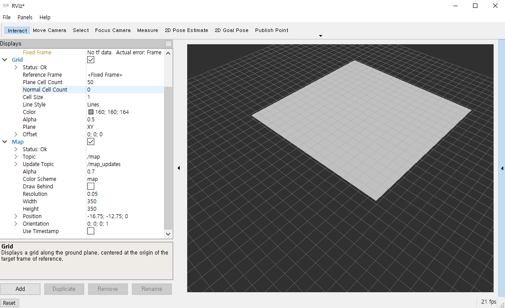

#### 2. 최단경로 탐색 및 경로 추종(Req 1-2)

- ros2 run sub2 odom

- ros2 run sub2 load_map

- ros2 run sub2 a_star

- rviz2 - Fixed Fram : map - 2D Goal Pose를 누르고 맵의 아무 곳을 찍는다.

  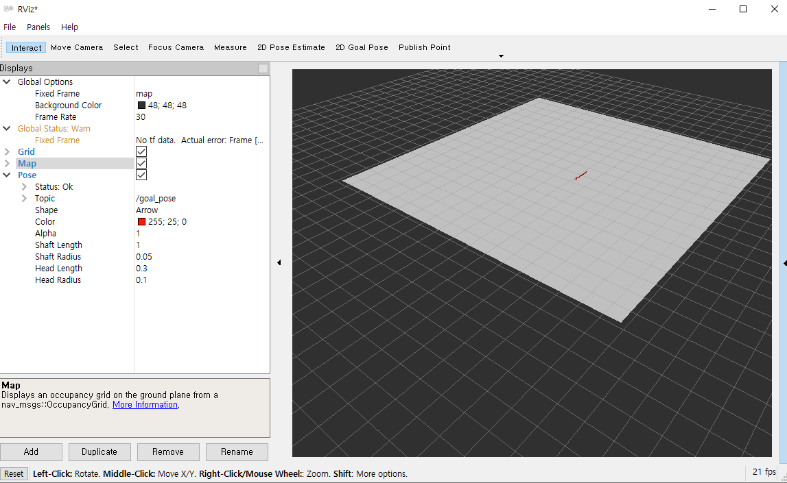

  - goal pose 메시지가 publish 되면서 콘솔창에 메시지가 출력된다.

  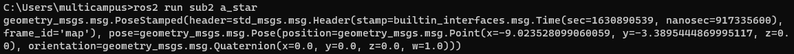

  - rviz2에 출력되는 모습

  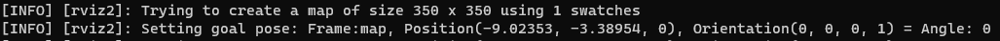

### 2. 인지 프로젝트(Req 2)

#### 1. Extrinsic Calibration(Req 2-1)

- 시뮬레이터 내 카메라와 라이다를 세팅한 후 노드 실행

- ros2 run sub2 ex_calib

  - 초기 실행 모습
  - ros 메시지의 테이터가 callback 함수를 통해 처리되지 않은 상태라서 wating for msg라는 형태로 나온다.

  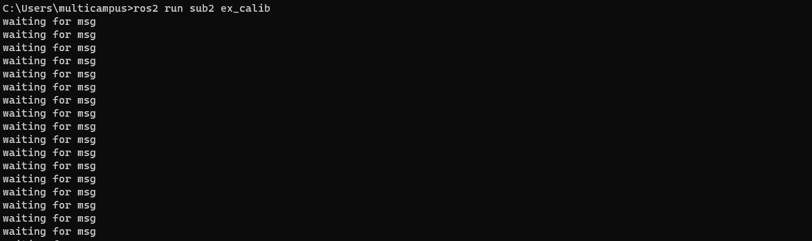

#### 사람인지(Req 2-2)

- 시뮬레이터 내 카메라를 세팅한 후 노드 실행

- ros2 run sub2 human_detector

  - 수신한 카메라의 원본을 보여주는 창이 생성된다.

  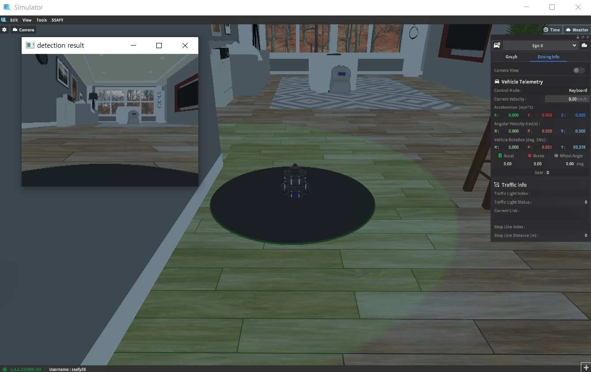

#### 3. 소지품 인지(Req 2-3)

- 시뮬레이터 내 카메라 세팅에서 ground truth 항목에 semantic을 선택하고 connect 한 후 노드 실행

- ros2 run sub2 seq_binarizer

  - 초기 실행 모습으로 시뮬레이터의 카메라 세팅이 Ground Truth : Semantic일 때 rgb 이미지가 아닌 segmented 이미지를 보여주는 창이 생성된다.

  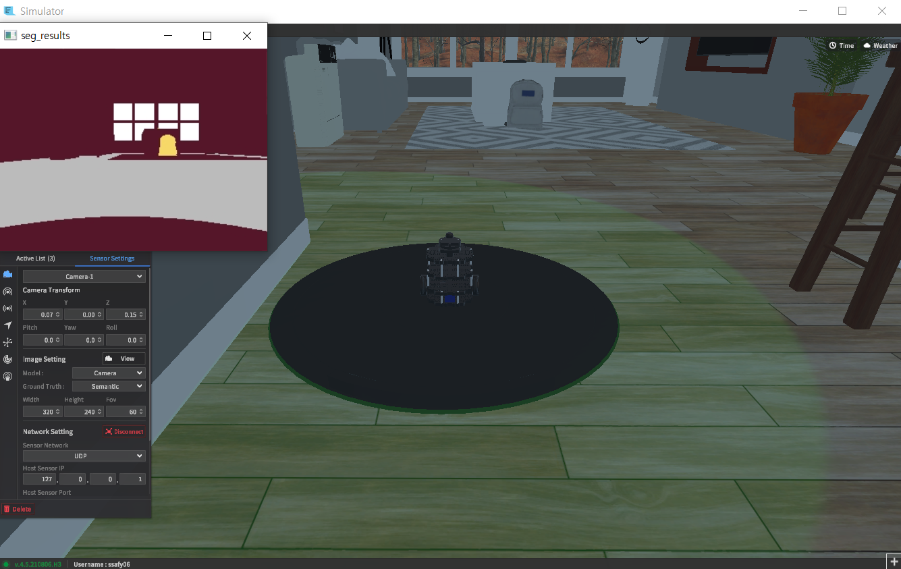

<br>

## 필수 지식 학습

### Extrinsic Calibration

- 실 세계는 3차원으로 이루어져있지만 이를 카메라로 촬영하게 되면 2차원 이미지로 투영된다. 이 때 실제 3차원 위치 좌표는 이미지 상에서 어디에 위치하는지 기하학적으로 계산할 때 영상을 찍을 당시의 카메라 위치 및 방향에 의해 결정된다. 하지만 실제 이미지는 사용된 렌즈, 대상과의 거리 등의 내부 요인에 영향을 받기 때문에 3차원 위치 좌표는 영상에 투영된 위치를 구하거나 역으로 영상 좌표로부터 3차원 공간좌표를 복원할 때 이러한 내부 요인을 제거해야 정확한 계산이 가능해진다. 이러한 내부 요인의 파라미터 값을 구하는 과정을 카메라 캘리브레이션이라고 한다. 
  - 출처: https://eehoeskrap.tistory.com/511 [Enough is not enough]

- 라이다와 카메라의 위치 및 자세를 나타내는 파라미터를 파악하여 라이다 포인트들과 카메라의 이미지를 받고 카메라 이미지 프레임 안에 라이다 포인트들을 정사영 시킨다.

- 카메라 이미지는 객체 인지에 쓰이지만 위치 정보를 가지고 있지 않기 때문에 라이다 포인트들을 이미지에 정사영시켜 이미지 내 객체들의 위치를 추정해볼 수 있게 한다.

:bulb: [**참고사이트**](https://darkpgmr.tistory.com/32#calibration0)

#### 1. Translation & Rotation Transformation Matrix

- 가장 기본적으로 쓰는 좌표변환 행렬은 4x4행렬로 표현된 평행이동(Translation)과 회전(Rotation)에 대한 좌표젼환 행렬이다.

- Translation

  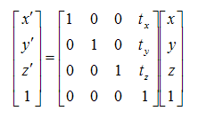

- Rotation

  - X, Y, Z 축을 기준으로 돌리는  오일러각으로 표현되며 roll, pitch, yaw라고 부른다.

    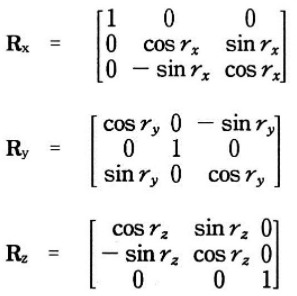

  - 회전 순서에 따라 전혀 다른 좌표 변환 행렬로 정의되기 때문에 주의해야 한다.

    - ex) local 좌표계 상의 장애물 좌표를 global 좌표계로 변환할 경우 yaw에 해당하는 변환 행렬이 필요하다.

#### 2. 라이다 - 카메라간 좌표 변환 순서

- 먼저 라이다 좌표에서 카메라 좌표로 Transition matrix를 적용하고 x축이 오른쪽으로 향하도록 z축 기준 90도 시계방향으로 회전시킨다. 그리고 z축이 카메라 정면을 향하도록 x축 기준으로 90도만큼 시계방향으로 회전 시킨다.
  - x축 기준으로 180도라고 되어있지만 결과값과 그림을 봤을 때 90도 시계방향이다.
- 최종적으로 계산된 행렬은 카메라 좌표의 x, y, z 벡터를 라이더 좌표계로 변환해주는 역할을 한다. 그 역행렬은 라이다 스캔 포인트 좌표들을 카메라 좌표계 기준으로 변환 시킨다.

- X = RT* X' 이라고 할 때 RT는 X'을 X 좌표계로 옮겨준다. 즉, X'에 들어오는 값이 카메라 좌표이면 이를 라이더 좌표계로 변환한다.

#### Projection

- 카메라에 들어오는 정보는 2차원이고 라이다의 포인트 클라우드는 3차원 정보이다. 이 두가지 정보를 병합시키고 싶을 때, 3차원 좌표를 2차원 평면 상으로 투영(Projection)시켜야 하는 경우가 있다.
  1. 먼저 위에서 설명한 변환행렬들을 사용하여 전체 좌표계에서 카메라 좌표계로 변환을 한다. 이 때, z축은 카메라 전방을 향하게 하는게 일반적이다. 그리고 z=1인 면을 Normalized plane이라 정의한다.
  2. Normalized plane 상에서 투영이 되었으면 현재 사용하고 있는 카메라의 파라미터를 가지고 Intrinsic matrix를 만들어야 한다. Intrinsic matrix를 곱해야 카메라에 나오는 이미지 크기에 맞게 조정이 가능하기 때문이다.

:bulb: [**참고사이트**](https://darkpgmr.tistory.com/32#calibration0)

<br>

## 기능/과제 상세

### Req. 2. 인지 프로젝트

#### Req. 2-1 Extrinsic Calibration

**`로직 순서`**

1. 라이다(/scan)의 포인트와 카메라의 이미지(/image_jpeg/compressed)를 subscriber한다.
2. LIDAR2CAMTranfrom 클래스를 가지고 좌표 변환 역할을 하는 self.l2c_trans를 정의한다.
3. 카메라 subscriber안에 들어가는 콜백 함수를 완성 시킨다.
   - np.frombuffer와 cv2.imdecode를 사용하여 data를 이미지 어레이로 만든다.
4. 라이다 포인트에 대한 메시지(LaserScan) 안에 range(거리)를 받는다. 이를 가지고 포인트들을 x, y 좌표계로 변환할 수 있다.
   - range는 길이 360의 어레이 형태로 되어 있고 1도만큼 돌아가면서 측정된 거리값이다.
5. 카메라에 들어가지 않는 뒤편의 라이다 포인트들은 정사영되지 않으므로 잘라낸다.
6. 라이다 위치를 원점으로 하는 포인트들을 카메라 위치를 원점으로 하는 좌표계상으로 좌표 변환을 시킨다.
7. 카메라 위치를 원점으로 하는 라이다 포인트들을 카메라 프레임 안의 픽셀 좌표계 상으로 정사영 시킨다.
8. 라이다 포인트 픽셀 좌표를 가지고 카메라 이미지에 포인트들을 그려준다.

- transformMTX_lidar2cam 함수 로직 완성하기

  - numpy는 radian을 사용하기 때문에 degree로 들어온 각도를 변환해준다.

    ```python
    lidar_yaw, lidar_pitch, lidar_roll = np.deg2rad(params_lidar["YAW"]), np.deg2rad(params_lidar["PITCH"]), np.deg2rad(params_lidar["ROLL"])
    cam_yaw, cam_pitch, cam_roll = np.deg2rad(params_cam["YAW"]), np.deg2rad(params_cam["PITCH"]), np.deg2rad(params_cam["ROLL"])
    
    # Relative position of lidar w.r.t cam
    lidar_pos = [params_lidar["X"], params_lidar["Y"], params_lidar["Z"]]
    cam_pos = [params_cam["X"], params_cam["Y"], params_cam["Z"]]
        
    # 출력 테스트
    print('lidar_yaw: {}, lidar_pitch: {}, lidar_roll: {},\ncam_yaw: {}, cam_pitch: {}, cam_roll: {}'.format(
            lidar_yaw, lidar_pitch, lidar_roll, cam_yaw, cam_pitch, cam_roll))
    print('lidar_pos: {}, cam_pos: {}'.format(lidar_pos, cam_pos))
    ```

  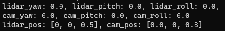

  - 라이다에서 카메라 까지 변환하는 translation 행렬을 정의

    ```python
    t_x, t_y, t_z = [lidar_pos[i] - cam_pos[i] for i in range(3)]
    Tmtx = translationMtx(t_x, t_y, t_z)
    ```

    - 카메라에서 바라본 라이더 위치를 구해서 translationMtx를 만든다.

  - 카메라 자세로 맞춰주는 rotation 행렬을 만든다.

    ```python
    Rmtx = np.matmul(rotationMtx(cam_yaw, cam_pitch, cam_roll), rotationMtx(lidar_yaw, lidar_pitch, lidar_roll))
    ```

  - Tmtx, Rmtx 행렬을 가지고 최종 라이다-카메라 변환 행렬을 정의한다.

    ```python
    rotation_yaw_90 = rotationMtx(math.pi/2, 0, 0)
    rotation_roll_90 = rotationMtx(0, 0, math.pi/2)
    rotation_axis = np.matmul(rotation_roll_90, rotation_yaw_90)
    RT = np.matmul(rotation_axis, np.matmul(Rmtx, Tmtx))
    ```

    - x축이 오른쪽을 향하고 z축이 카메라 방향과 일치하도록 회전시킨다.
    - 여기서 구한 RT의 예시로 X' = RT * X라 하면 X좌표를 X'좌표로 옮겨준다. 즉, X에 라이다 좌표를 넣게 되면 카메라 좌표로 바꿔준다.

  :white_check_mark: 벡터 연산과 행렬의 순서, 전치행렬을 이해하는데 시간이 오래걸렸다. 추가적으로 좌표계를 회전시킬 때 명세에는 180도라고 되어있지만 그림에 나와있는 90도가 맞는 값이었다.

- project2img_mtx 함수 로직 완성하기

  ```python
  # 로직 1. params에서 카메라의 width, height, fov를 가져와서 focal length를 계산.
      fc_x = params_cam["HEIGHT"]/(2*math.tan(np.deg2rad(params_cam["FOV"]/2)))
      fc_y = params_cam["HEIGHT"]/(2*math.tan(np.deg2rad(params_cam["FOV"]/2)))
  
  # 로직 2. 카메라의 파라메터로 이미지 프레임 센터를 계산.
  
      cx = params_cam["WIDTH"]/2
      cy = params_cam["HEIGHT"]/2
  
  # 로직 3. Projection 행렬을 계산.
      R_f = np.array([[fc_x, 0, cx],
                      [0, fc_y, cy]])
  ```

  - 명세서에 있는 내용을 그대로 구현

- LIDAR2CAMTransform 클래스 로직 완성하기

  ```python
  class LIDAR2CAMTransform:
      def __init__(self, params_cam, params_lidar):
  
          """
          LIDAR2CAMTransform 정의 및 기능 로직 순서
          1. Params를 입력으로 받아서 필요한 파라메터들과 RT 행렬, projection 행렬 등을 정의. 
          2. 클래스 내 self.RT로 라이다 포인트들을 카메라 좌표계로 변환.
          3. RT로 좌표 변환된 포인트들의 normalizing plane 상의 위치를 계산. 
          4. normalizing plane 상의 라이다 포인트들에 proj_mtx를 곱해 픽셀 좌표값 계산.
          5. 이미지 프레임 밖을 벗어나는 포인트들을 crop.
          """
          
          # 로직 1. Params에서 필요한 파라메터들과 RT 행렬, projection 행렬 등을 정의
          self.width = params_cam["WIDTH"]
          self.height = params_cam["HEIGHT"]
  
          self.n = float(params_cam["WIDTH"])
          self.m = float(params_cam["HEIGHT"])
  
          self.RT = transformMTX_lidar2cam(params_lidar, params_cam)
  
          self.proj_mtx = project2img_mtx(params_cam)
  
      def transform_lidar2cam(self, xyz_p):
          
          xyz_c = xyz_p
            
          # 로직 2. 클래스 내 self.RT로 라이다 포인트들을 카메라 좌표계로 변환시킨다.
  
          # 4*4 매트릭스에 3차원 좌표를 곱하기 위해서 ones를 추가
          xyz_c = np.matmul(self.RT, np.concatenate([xyz_c, np.ones((xyz_c.shape[0], 1))], axis=1).T)
          
          return xyz_c    # xyz_c : RT로 좌표 변환된 포인트들
  
      def project_pts2img(self, xyz_c, crop=True):
  
          xyi = np.zeros((xyz_c.shape[0], 2))
  
          # 로직 3. RT로 좌표 변환된 포인트들의 normalizing plane 상의 위치를 계산.
  
          # xyz_c[0, :].reshape([1, -1]) : [[1 2 3] [4 5 6] [7 8 9]] 값이 있다면 [[1 2 3]] 값이 나온다.
          xc, yc, zc = xyz_c[0, :].reshape([1, -1]), xyz_c[1, :].reshape([1, -1]), xyz_c[2, :].reshape([1, -1])
          xn, yn = xc / (zc + 0.0001), yc / (zc + 0.0001)   # 분모에 0이 들어가지 않게 하기 위해서 0.0001을 더해준다.
          
          # 로직 4. normalizing plane 상의 라이다 포인트들에 proj_mtx를 곱해 픽셀 좌표값 계산.
  
          xyi = np.matmul(self.proj_mtx, np.concatenate([xn, yn, np.ones_like(xn)], axis=0))
          xyi = xyi[0:2, :].T
  
          # 로직 5. 이미지 프레임 밖을 벗어나는 포인트들을 crop.
  
          if crop:
              xyi = self.crop_pts(xyi)
          else:
              pass
          return xyi
  
      def crop_pts(self, xyi):
  
          xyi = xyi[np.logical_and(xyi[:, 0]>=0, xyi[:, 0]<self.width), :]
          xyi = xyi[np.logical_and(xyi[:, 1]>=0, xyi[:, 1]<self.height), :]
  
          return xyi
  ```

  - self.RT와의 연산을 통해 라이다 포인트들을 카메라 좌표계로 반환해준다.
  - concatenate : 4*4매트릭스에 3차원 좌표를 곱하기 위해 사용(행 or 열을 추가)
  - xn, xy는 normalizing plane 상의 위치를 계산
  - xyi는 normalizing plane 상의 라이다 포인트들의 픽셀 좌표 값
  - crop 함수를 통해 이미지 프레임 밖을 벗어나는 포인트들을 crop

- 카메라 콜백함수에서 이미지 클래스 내 변수로 저장

  ```python
  np_arr = np.frombuffer(msg.data, np.uint8)
  
  self.img = cv2.imdecode(np_arr, cv2.IMREAD_COLOR)
  ```

- 라이다 2d scan data(거리와 각도)를 가지고 x, y 좌표계로 변환

  ```python
  self.R = np.array(msg.ranges)
  
          x = self.R * np.cos(np.linspace(0, 2 * np.pi, 360))
          y = self.R * np.sin(np.linspace(0, 2 * np.pi, 360))
          z = np.zeros_like(x)
  
          self.xyz = np.concatenate([
              x.reshape([-1, 1]),
              y.reshape([-1, 1]),
              z.reshape([-1, 1])
          ], axis=1)
  ```

- 라이다 x, y 좌표 데이터 중 정면 부분만 crop

  ```python
  xyz_p = self.xyz[np.where(self.xyz[:, 0] >= 0)]
  ```

- transformation class의 transform_lidar2cam으로 라이다 포인트를 카메라 3d 좌표로 변환

  ```python
  xyz_c = self.l2c_trans.transform_lidar2cam(xyz_p)
  ```

- transformation class의 project2img로 라이다 포인트를 2d 픽셀 좌표상으로 정사영

  ```python
  xy_i = self.l2c_trans.project_pts2img(xyz_c, crop=True)
  ```

- draw_pts_img()로 카메라 이미지에 라이다 포인트를 draw하고 show

  ```python
  def draw_pts_img(img, xi, yi):
  
      point_np = img
  
      #Left Lane
      for ctr in zip(xi, yi):
          point_np = cv2.circle(point_np, ctr, 2, (255,0,0),-1)
  
      return point_np
  
  img_l2c = draw_pts_img(self.img, xy_i[:, 0].astype(np.int32),xy_i[:, 1].astype(np.int32))
  
              cv2.imshow("Lidar2Cam", img_l2c)
              cv2.waitKey(1)
  ```

  - cv2.circle(img, center, radian, color, thickness)

    :bulb: [**참고**](https://opencv-python.readthedocs.io/en/latest/doc/03.drawShape/drawShape.html)

    - img – 그림을 그릴 이미지, center - 원의 중심 좌표(x, y), radian - 반지름, color - BGR형태의 color, thickness - 선의 두께, -1이면 원 안쪽을 채운다.

- **결과 사진**

  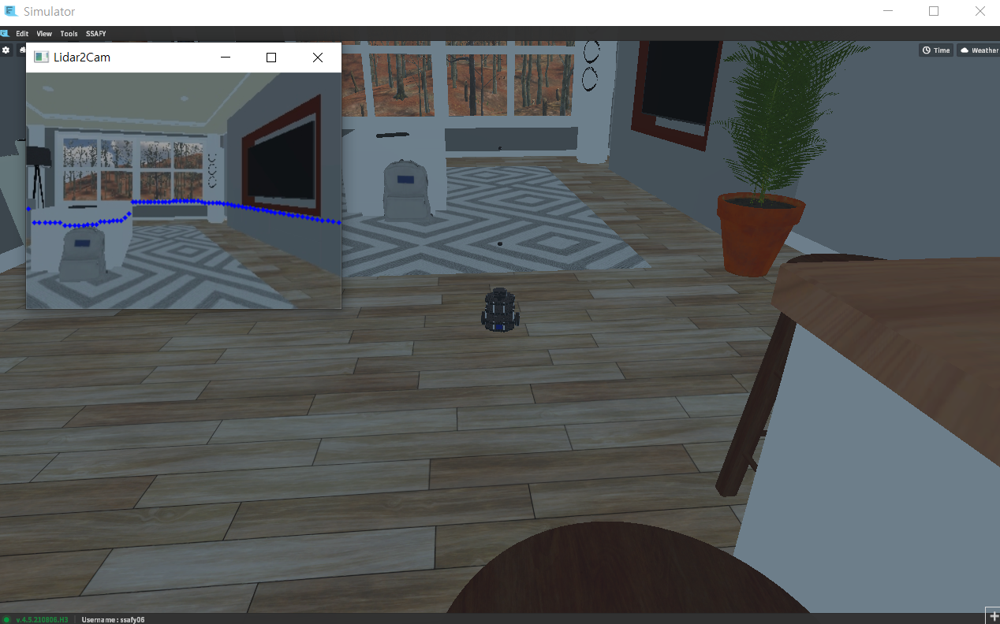

#### Numpy Method 참고

- where

  :bulb: [**참고**](https://ponyozzang.tistory.com/501)

  ```python
  import numpy as np
  
  xyz = np.array([[1,2,3],[-4,-5,-6],[7,8,9]])
  
  print('xyz[:, 0] -> ', xyz[:, 0])
  # xyz[:, 0] ->  [ 1 -4  7]
  print('np.where(xyz[:, 0] >= 0) -> ', np.where(xyz[:, 0] >= 0))
  # np.where(xyz[:, 0] >= 0) ->  (array([0, 2], dtype=int64),)
  print('xyz[np.where(xyz[:, 0] >= 0)] -> ', xyz[np.where(xyz[:, 0] >= 0)])
  # xyz[np.where(xyz[:, 0] >= 0)] ->  [[1 2 3]
  ```

- shape, reshape

  :bulb: [**참고**](https://yganalyst.github.io/data_handling/memo_5/)

  ```python
  print(xyz.shape)
  # (3, 3)
  print(xyz.shape[0])
  # 3
  print(np.ones((xyz.shape[0], 1)))
  # [[1.]
  #  [1.]
  #  [1.]]
  print(xyz[0, :].reshape([1, -1]))
  # [[1 2 3]]
  ```

- zeros

  :bulb: [**참고**](https://algopoolja.tistory.com/37)

  ```python
  print(np.zeros((xyz.shape[0], 2)))
  # [[0. 0.]
  #  [0. 0.]
  #  [0. 0.]]
  ```

- concatenate

  :bulb: [**참고**](https://pybasall.tistory.com/33)

  ```python
  print(np.concatenate([xyz, np.ones((1, xyz.shape[1]))], axis=0))
  # [[ 1.  2.  3.]
  # [-4. -5. -6.]
  # [ 7.  8.  9.]
  # [ 1.  1.  1.]]
  print(np.concatenate([xyz, np.ones((xyz.shape[0], 1))], axis=1).T)
  # [[ 1. -4.  7.]
  # [ 2. -5.  8.]
  # [ 3. -6.  9.]
  # [ 1.  1.  1.]]
  ```

- logical_and

  :bulb: [**참고**](https://m.blog.naver.com/PostView.naver?isHttpsRedirect=true&blogId=wideeyed&logNo=221621793997)

  ```python
  print(xyz[np.logical_and(xyz[:, 0]>=0, xyz[:, 0]<4), :])
  # [[1 2 3]]
  xyz_pp = xyz[np.logical_and(xyz[:, 0]>=0, xyz[:, 0]<4), :]
  print(xyz_pp[:, 0])
  # [1]
  print(xyz_pp[np.logical_and(xyz_pp[:, 0]>=0, xyz_pp[:, 0]<3), :])
  # [[1 2 3]]
  ```

- linspace

  :bulb: [**참고**](https://m.blog.naver.com/choi_s_h/221730568009)

#### Req. 2-2 사람 인지

#### Req. 2-3 소지품 인지