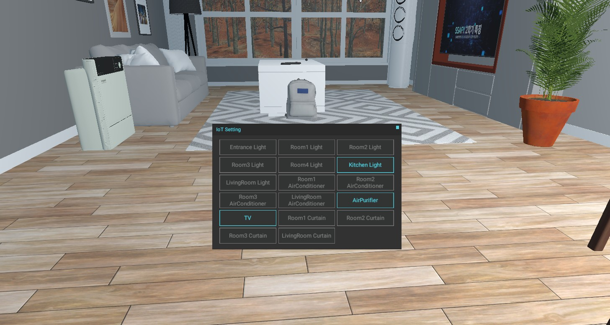
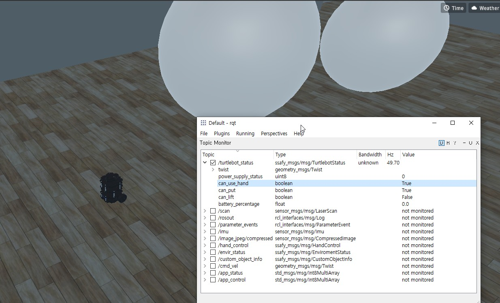
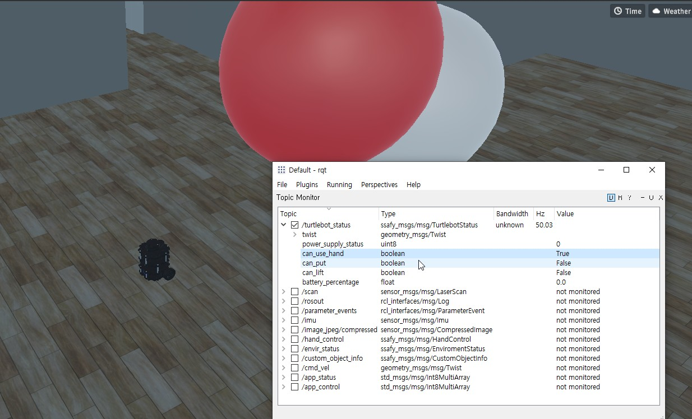
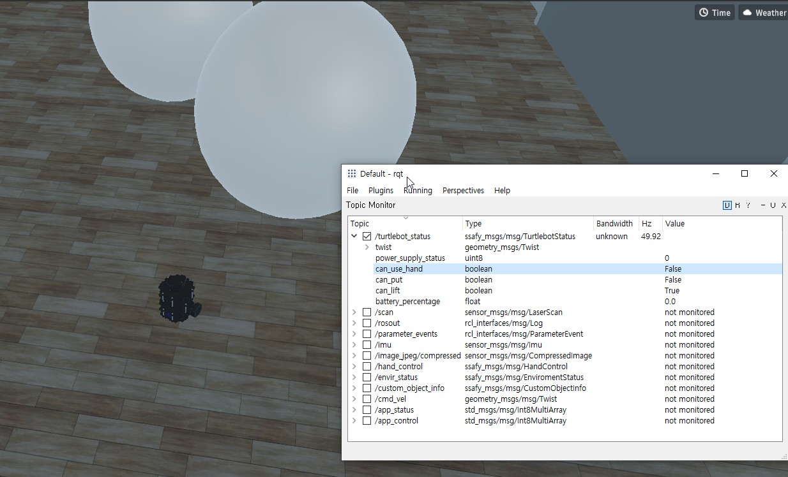

# IoT제어 프로젝트

## 1. 프로젝트 개요

## 2. 프로젝트 목표

1. ROS2 메시지 통신에 대한 이해와 실습

2. 영상 데이터를 수신하여 openCV 라이브러리 활용하기

3. 로봇 상태 정보 수신 및 제어 데이터 전송

4. IOT 상태 정보 수신 및 제어 데이터 전송

5. 환경 상태 정보 수신 및 출력

6. Custom Object Hand control 제어 데이터 전송

7. IMU 센서 이해 및 활용

8. 주행 기록계 만들기

9. 주행기록 기반 경로 생성 및 저장

10. 경로 추종(Follow the Carrot)

## 3. Ros2 명령어

1. 빌드하기
   call C:\dev\ros2_eloquent\setup.bat
   cd C:\Users\wlsdu\Desktop\catkin_sub1
   colcon build or colcon build --packages-select sub1

2. 노드 실행하기
   call C:\dev\ros2_eloquent\setup.bat
   call C:\Users\wlsdu\Desktop\catkin_sub1\install\local_setup.bat
   ros2 run sub1

3. 시뮬레이션 통신
   call C:\dev\ros2_eloquent\setup.bat
   cd C:\Users\wlsdu\Desktop\catkin_sub1\src\ssafy_bridge\launch
   call C:\Users\wlsdu\Desktop\catkin_sub1\install\local_setup.bat
   ros2 launch ssafybridge_launch.py

4. 시각화도구들
   call C:\dev\ros2_eloquent\setup.bat
   call C:\Users\wlsdu\Desktop\catkin_sub1\install\local_setup.bat
   rqt
   rviz2

## 4. 프로젝트 실행 및 결과

### ROS 메시지 통신 및 노드 실행

#### 4.1 sub-pub

### 4.2 IoT의 상태, 제어 메시지 송수신

#### control 결과값

#### 시뮬 값

### 4.3 카메라 데이터 수신 및 영상처리

#### 영상처리

### 4.4 Hand Control 제어 메시지 송신

#### 옮기기 전

#### 옮기기

#### 옮기기 불가능 예시

#### put down

### 4.5 Odometry를 이용한 상대경로 생성 및 경로 추종

#### 경로 생성

#### 경로 추적

