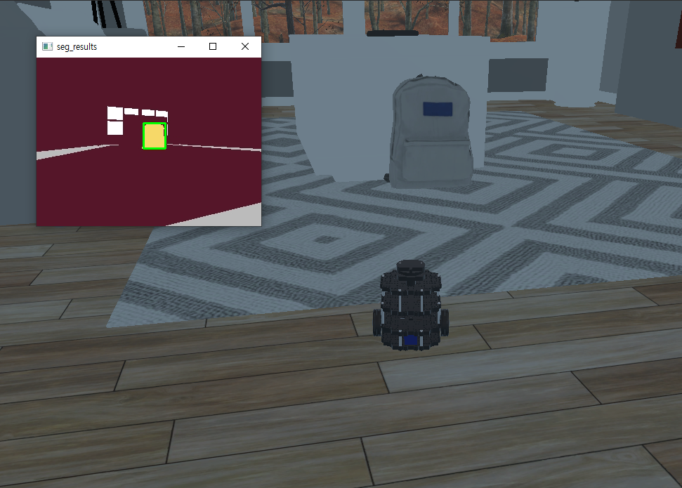

## IoT제어 프로젝트 SUB 2

### seg_binarizer.py

- 초기 실행

  imshow 창 띄우기

  세팅 바꾸고 나서 시뮬레이터 나갔다가 미리 모든 ros run한 상태로 시작해야지 창이 뜬다.

  코드에 문제가 없는데 새창이 안뜬다면 

  - 네트워크 세팅 확인
  - 카메라 세팅 확인 

  이후에 재부팅 하자.

- 로직 3. bgr 이미지 binarization

  오브젝트 bgr 가져오기 = 시뮬레이터 메뉴얼 참조 or 이미지 캡처 후 그림판에서 데이터 추출

  

  Image binarization(이미지 이진화) - 일정 범위를 기준으로 0 or 255 로 해서 흑백으로 나눔

  이 기능을 이용하면 배경에서 해당 이미지를 분리해낼 수 있음

  https://gmnam.tistory.com/263

  https://webnautes.tistory.com/1034

  의문점: 오브젝트의 bgr을 내가 일일이 맞춰줘야하나? 이걸 자동화 못하나?

  방안? 오브젝트의 bgr을 한 번 로봇에게 보여줘 인식할 수 있도록 한 후, 이후에는 스스로 찾게 하면 될 듯

  opencv - cv.inRange()

  https://deep-learning-study.tistory.com/123

  특정 색상 영역을 추출할 때는 HSV 색 공간이 더 효과적이라고 한다.

  BGR => HSV로 전환 후 색 추출

  findContour

  https://opencv-python.readthedocs.io/en/latest/doc/15.imageContours/imageContours.html

- 로직 실행 화면

  

