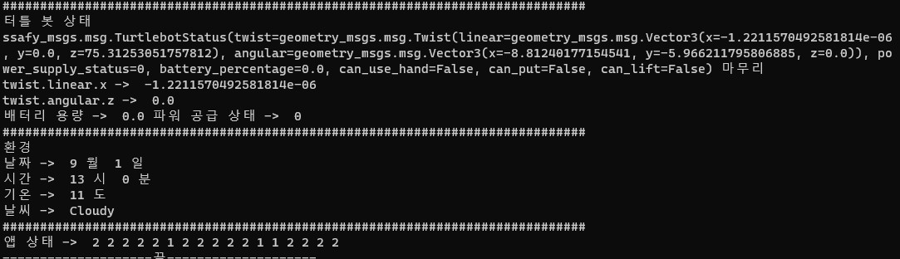
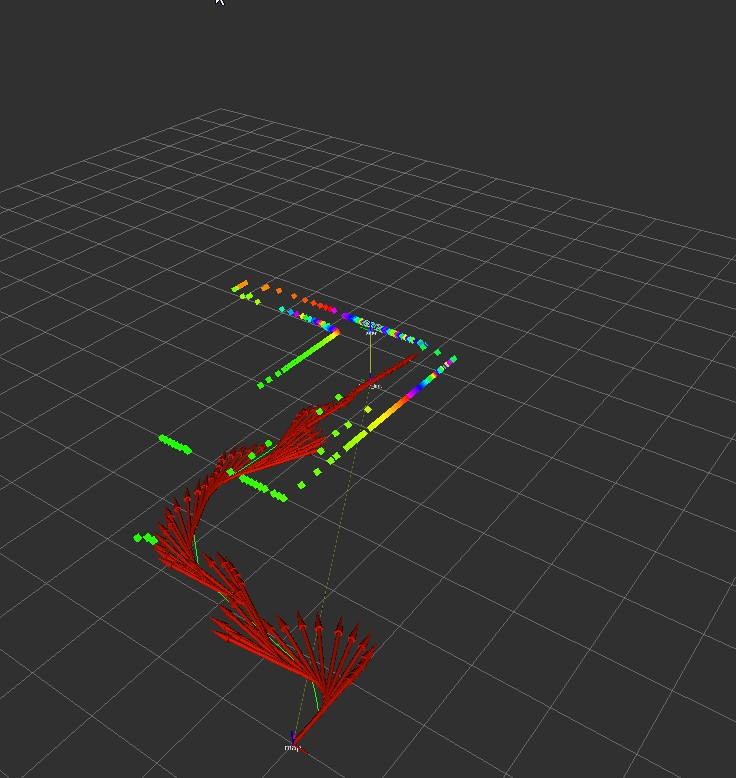

# IoT제어 프로젝트

## 1. 프로젝트 개요

1 ~ 5 까지 명세 해결(100%)

## 2. 프로젝트 목표

1. ROS2 메시지 통신에 대한 이해와 실습

2. 영상 데이터를 수신하여 openCV 라이브러리 활용하기

3. 로봇 상태 정보 수신 및 제어 데이터 전송

4. IOT 상태 정보 수신 및 제어 데이터 전송

5. 환경 상태 정보 수신 및 출력

6. Custom Object Hand control 제어 데이터 전송

7. IMU 센서 이해 및 활용

8. 주행 기록계 만들기

9. 주행기록 기반 경로 생성 및 저장

10. 경로 추종(Follow the Carrot)

## 3. Ros2 명령어

1. 빌드하기

   - call C:\dev\ros2_eloquent\setup.bat
   - cd C:\Users\wlsdu\Desktop\catkin_sub1
   - colcon build or colcon build --packages-select sub1

2. 노드 실행하기

   - call C:\dev\ros2_eloquent\setup.bat
   - call C:\Users\wlsdu\Desktop\catkin_sub1\install\local_setup.bat
   - ros2 run sub1

3. 시뮬레이션 통신

   - call C:\dev\ros2_eloquent\setup.bat
   - cd C:\Users\wlsdu\Desktop\catkin_sub1\src\ssafy_bridge\launch
   - call C:\Users\wlsdu\Desktop\catkin_sub1\install\local_setup.bat
   - ros2 launch ssafybridge_launch.py

4. 시각화도구들
   - call C:\dev\ros2_eloquent\setup.bat
   - call C:\Users\wlsdu\Desktop\catkin_sub1\install\local_setup.bat
   - rqt
   - rviz2

## 4. 프로젝트 실행 및 결과

### ROS 메시지 통신 및 노드 실행

#### 4.1 sub-pub

- pub가 메시지를 발송하면 sub가 메시지를 받는 것을 볼 수 있다.
  

### 4.2 IoT의 상태, 제어 메시지 송수신

#### control 결과값

- 터틀 봇 상태와 환경 및 iot기기 상태를 알려준다.
  

#### 시뮬 값

- 기기가 1로 바뀌면서 3개 on된것을 확인 할 수 있다.
  

### 4.3 카메라 데이터 수신 및 영상처리

#### 영상처리

- RGB, Gray, resize 이미지를 확인할 수 있다.
  

### 4.4 Hand Control 제어 메시지 송신

#### 옮기기 전

#### 옮기기

#### 옮기기 불가능 예시

#### put down

### 4.5 Odometry를 이용한 상대경로 생성 및 경로 추종

#### 경로 생성

- odom/ makepath를 통해 경로.txt를 만든다.
  

#### 경로 추적

- 만들어진 경로.txt를 불러와 path_tracking한다 imu는 오차를 줄여주는 역활을 한다.
  

## 4. 느낀점 어려웠던 점

### 느낀점

1. ros2가 stompjs와 비슷한 느낌이었다.

### 힘들게 했던 점

1. 시뮬레이션에서 이미지 센서만 데이터가 들어오지 않아 시뮬레이션을 2번정도 재설치하고 백신을 모두 끄고 난 뒤로는 잘 된다 하지만 시간을 이틀 이상 소요하였다.
