## 시연 시나리오(스크립트 포함)

시연 순서에 따른 site 화면별, 실행별(클릭 위치 등) 상세 설명

1. 로그인

   주소 들어왔을때 제일 먼저 볼수있는 화면

   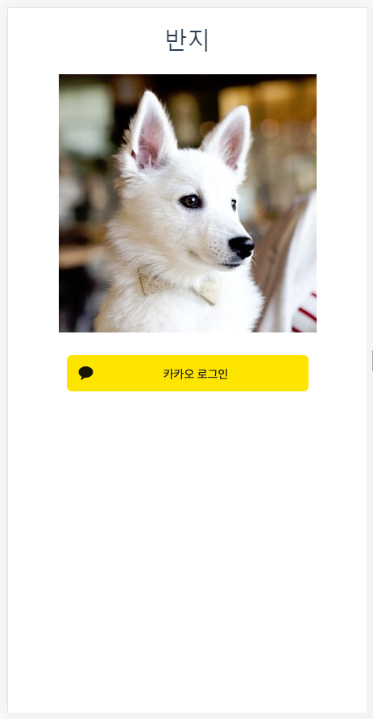

2. Home(메인화면)

   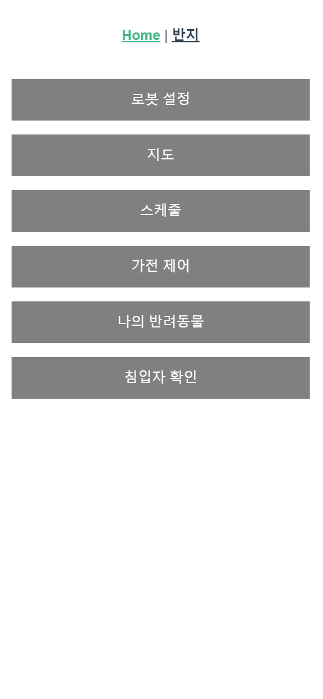

3. 로봇 설정

   로봇과 연결되지 않는 경우 스피너 회전

   연결이 하나라도 된 경우 화면 전환

   연결이 되지 않은 정보는 업데이트 누르면 각각 다시 불러옴

   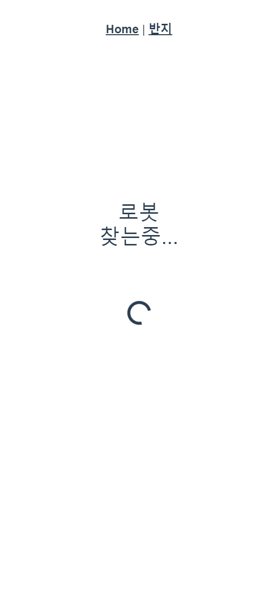

   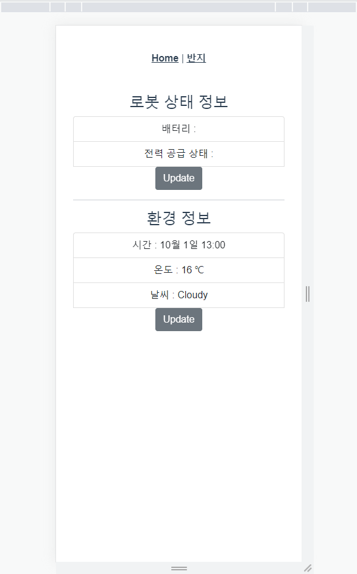

   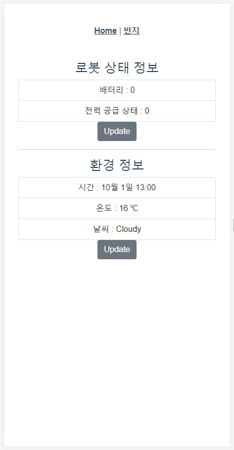

4. 지도

   지도

   - 지도 위 클릭 시 자동 이동

   - 움직이는 위치 초록점으로 표시

   - 로봇 위치 빨간점으로 표시

   실시간 영상

   수동 이동

   스크린샷

   - 실시간 영상을 불러올수 있는 경우만 스크린샷 버튼 생성
   - 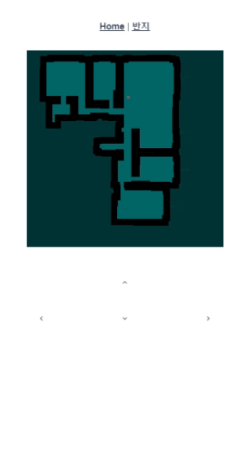

   

   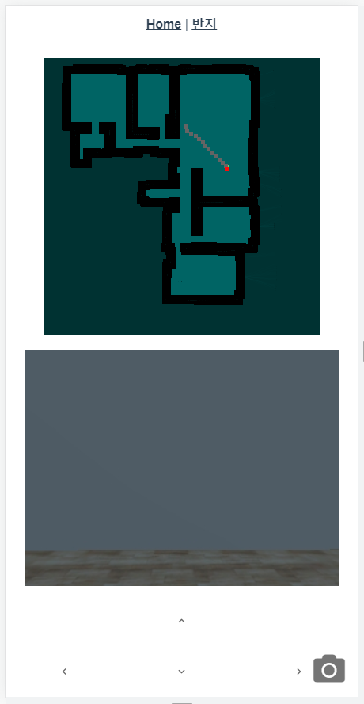

5. 스케줄

   플러스 `+`  버튼 클릭시 스케줄 생성 가능

   날짜 클릭시 해당 일자로 넘어감 - 해당 일자의 모든 일정 볼수있음

   동그라미 버튼 클릭시 달력으로 넘어감, 좌, 우 버튼 클릭시 이전 달, 다음 달로 이동

   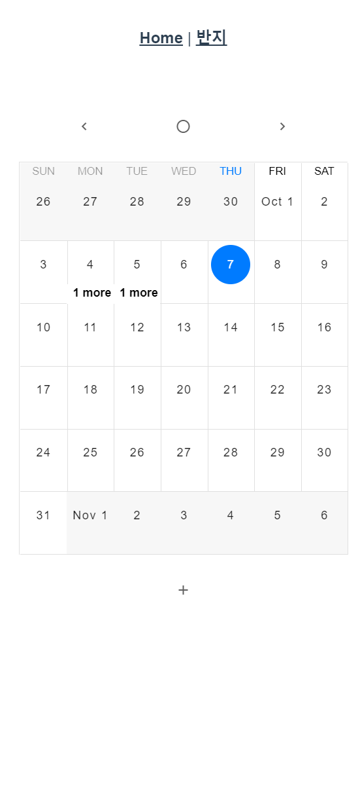

   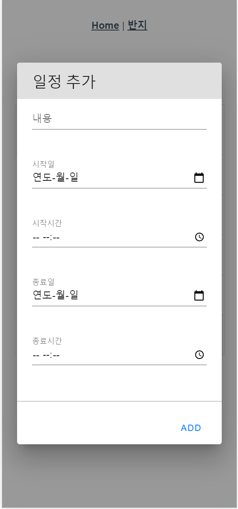

   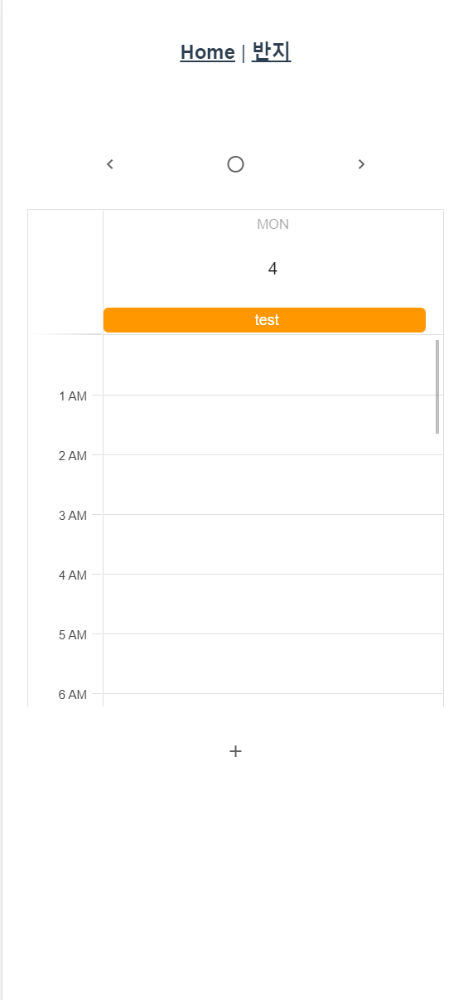

6. 가전 제어

   바운더리에 들어갔을 때 버튼으로 가전 제어

   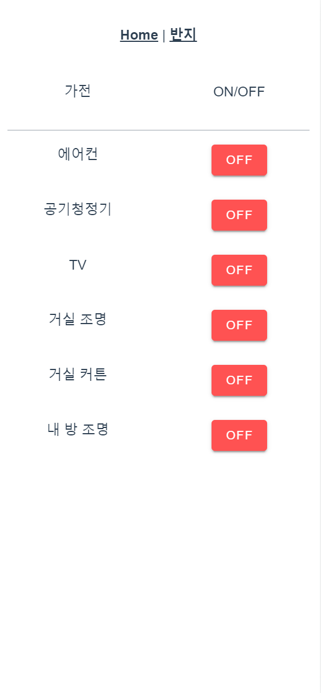

7. 나의 반려동물

   스크린샷으로 찍은 사진들 보여줌

   파일이름 클릭시 사진 팝업

   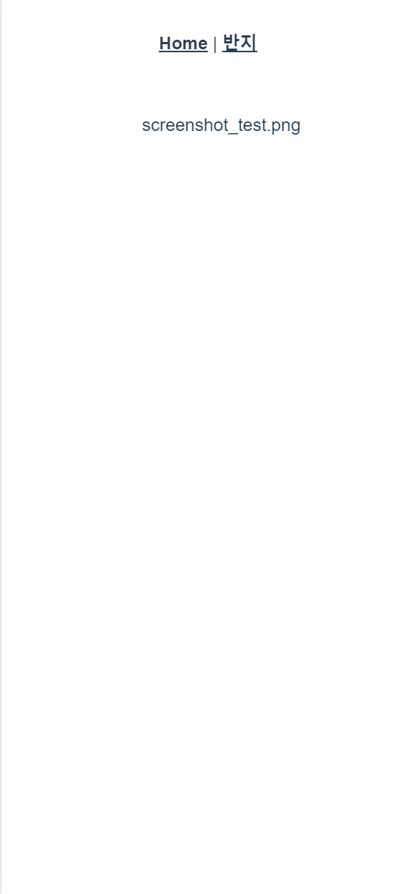

   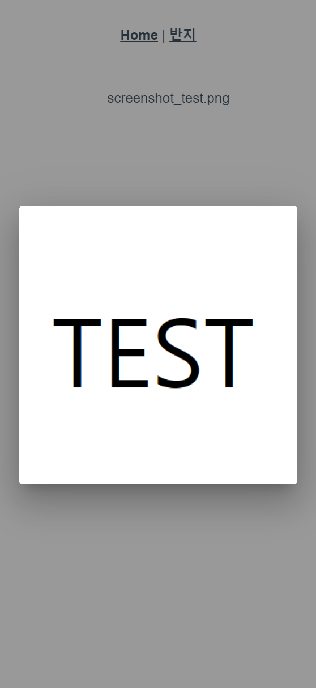

8. 침입자 확인

   로봇의 카메라로 사람이 인식되는 경우 오른쪽 상단에 알림 표시(상시 인식)

   상단 표시 클릭 혹은 Home의 침입자 확인 클릭하면 인식된 사진 확인 가능

   반려동물과 같이 팝업으로 보여줌

   업데이트 버튼 클릭시 새로고침

   - 사람은 아니지만 사람으로 인식했습니다.

   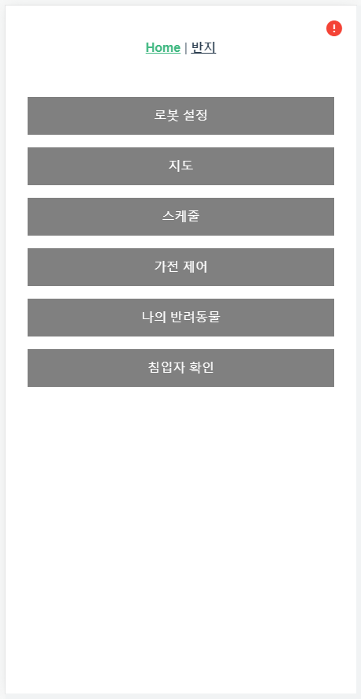

   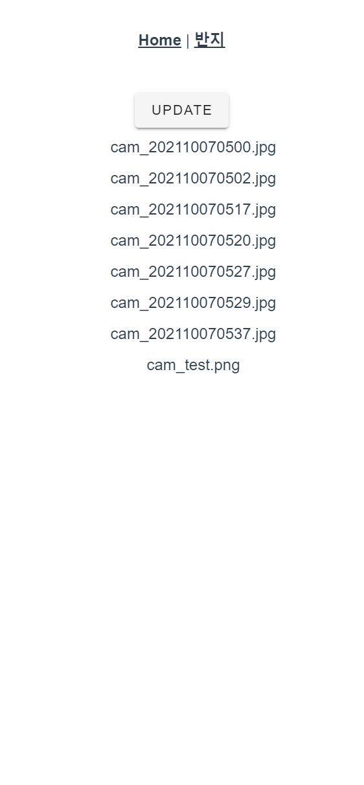

   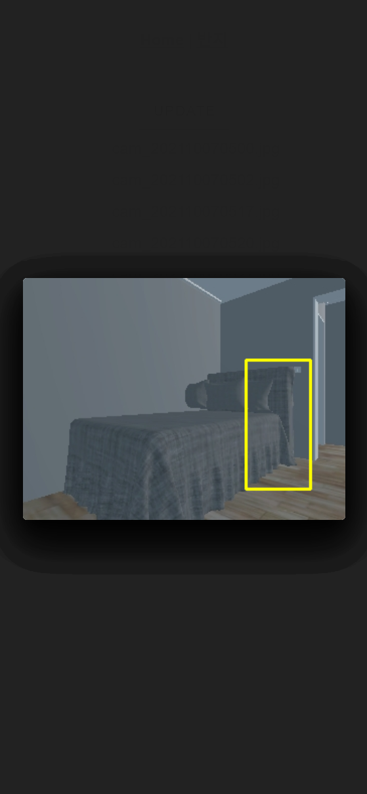

9. 반지

   팀소개

   로그아웃 버튼 클릭시 1로 넘어감

   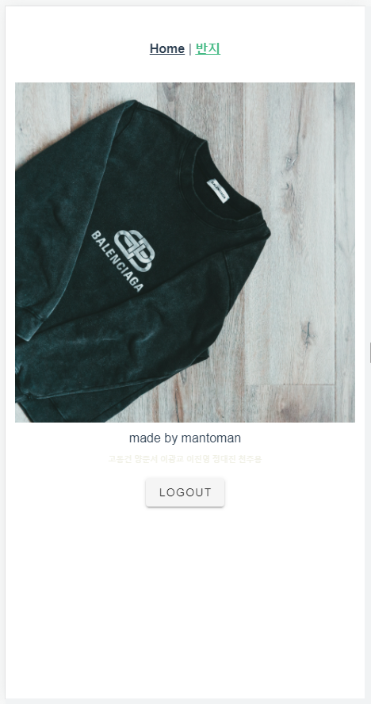

   

   

   