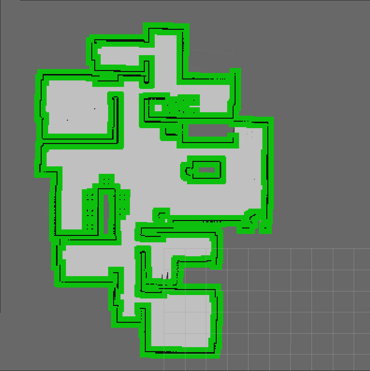
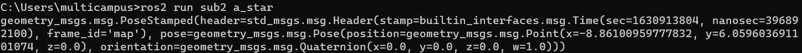
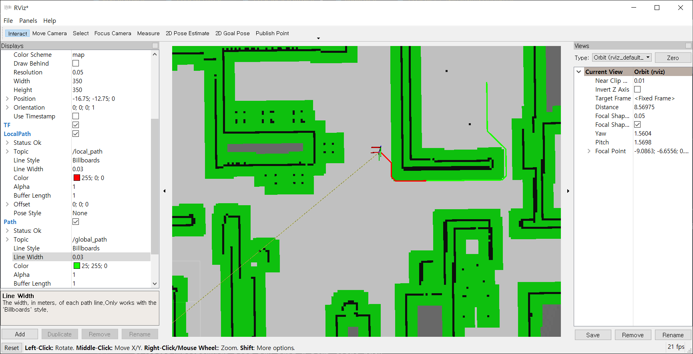

# SUB PJT 2 

자율 주행에 필요한 인지, 판단, 제어 알고리즘 학습

## 환경

1. ROS

   - ROS eloquent - 20200124 release
   - python 3.7.5
   - openssl 1.0.2u
   - choco 0.10.15
   - opencv 3.4.6
   - rti 5.3.1
   - opensplice 6.9.190403

2. tensorflow

   - tnesorflow 1.15
   - CUDA Toolkit 10.0
   - cuDNN 7.6.4

   

## 목표

1. 그리드 맵 기반 경로 계획(A* 알고리즘)
2. 좌표 변환에 대한 이해
3. 카메라 라이다간 calibration
4. opencv를 사용한 침입자 인지
5. semantic 이미지를 이용한 소지품 인지


## 필수 지식 학습

### 최단 경로 생성

맵 기반 경로 생성

- 맵을 구축해야하는 번거로움이 있음
- 목적지만 찍으면 목적지까지 가는 경로를 동적으로 생성할수있음


최단경로(최적화된 경로, cost가 낮은 경로)

- Dijkstra 알고리즘

  - grid 맵의 한 칸을 노드라고 했을때 출발 노드에서 모든 노드까지의 최단 거리를 구하는 알고리즘

- A *(A star) 알고리즘(얘 사용)

  - g(x): 현재 상태의 비용, h(x): 현재 상태에서 다음 상태로 이동할때의 휴리스틱 함수
  - f(x) = g(x) + h(x), 둘을 더한 값이 최소가 되는 지점을 우선적으로 탐색
  - f(x) = g(x) 인경우 다익스트라 알고리즘과 동일

  의사 코드

  ```python
  q = heapq()
  heappush(q, start_node, g(start_node)+h(start_node))
  while q:
      cur_node = heappop(q) # 우선순위 큐에서 가장 작은 값을 가져옴
      
      if cur_node == goal_node: # 목적지에 도착하면 반복문 종료
  		break
      
      for adj_node in cur_node: # 현재 노드의 인접한 점들을 탐색
          heappush(q, adj_node, g(cur_node) + h(adj_node) + cost)
          # 우선순위 큐에 인접 노드 삽입
  
  return goal_node_dist
  ```


### Extrinsic Calibration

물체의 거리 추정을 위해 사용

라이다와 카메라의 위치가 각각 다르므로 하나로 통합시켜서 물체의 거리추정

#### 좌표 변환

1. Translation & Rotation Transformation Matrix

   4 X 4 행렬로 표현된 평행이동과 회전에 대한 좌표 변환 행렬

   **평행이동 변환 행렬**
   $$
   \begin{pmatrix}
   X_1 \\ Y_1 \\ Z_1\\ 1
   \end{pmatrix}
   =  
   \begin{pmatrix}
   1 & 0 & 0 & x_T \\
   0 & 1 & 0 & y_T \\
   0 & 0 & 1 & z_T \\
   0 & 0 & 0 & 1
   \end{pmatrix}
   \begin{pmatrix}
   X_2 \\ Y_2 \\ Z_2 \\ 1
   \end{pmatrix}
   $$
   **회전 변환 행렬**

   1. roll
      $$
      \begin{pmatrix}
      X_1 \\ Y_1 \\ Z_1\\ 1
      \end{pmatrix}
      =  
      \begin{pmatrix}
      1 & 0 & 0 & 0 \\
      0 & cos \phi & -sin \phi & 0 \\
      0 & sin \phi & cos \phi & 0 \\
      0 & 0 & 0 & 1
      \end{pmatrix}
      \begin{pmatrix}
      X_2 \\ Y_2 \\ Z_2 \\ 1
      \end{pmatrix}
      $$
      
   2. pitch
      $$
      \begin{pmatrix}
      X_1 \\ Y_1 \\ Z_1\\ 1
      \end{pmatrix}
      =  
      \begin{pmatrix}
      cos \theta & 0 & sin \theta & 0 \\
      0 & 1 & 0 & 0 \\
      -sin \theta & 0 & cos \theta & 0 \\
      0 & 0 & 0 & 1
      \end{pmatrix}
      \begin{pmatrix}
      X_2 \\ Y_2 \\ Z_2 \\ 1
      \end{pmatrix}
      $$
      
   3. yaw
      $$
      \begin{pmatrix}
      X_1 \\ Y_1 \\ Z_1\\ 1
      \end{pmatrix}
      =  
      \begin{pmatrix}
      cos \psi & -sin \psi & 0 & 0 \\
      sin \psi & cos \psi & 0 & 0 \\
      0 & 0 & 1 & 0 \\
      0 & 0 & 0 & 1
      \end{pmatrix}
      \begin{pmatrix}
      X_2 \\ Y_2 \\ Z_2 \\ 1
      \end{pmatrix}
      $$
   
   **장애물 위치 추정시 Global/Local 좌표 변환**
   $$
   \begin{pmatrix}
   X_1 \\ Y_1 \\ 1
   \end{pmatrix}
   =  
   \begin{pmatrix}
   cos \theta & -sin \theta & 0 \\
   sin \theta & cos \theta & 0  \\
   0 & 0 & 1 
   \end{pmatrix}
   \begin{pmatrix}
   1 & 0 & p_x \\
   0 & 1 & p_y  \\
   0 & 0 & 1 
   \end{pmatrix}
   \begin{pmatrix}
   X_2 \\ Y_2 \\ 1
   \end{pmatrix}_L
   $$
   
2. 라이다 카메라간 좌표 변환 순서

   1. 라이다 좌표 -> 카메라 좌표: Transition matrix 적용
   2.  x축이 오른쪽으로 향하도록 z축 기준 90도 시계방향으로 회전
   3. z축이 카메라 정면을 향하도록 x축 방향으로 180도 만큼 시계방향으로 회전

   $$
   \begin{pmatrix}
   X_1 \\ Y_1 \\ Z_1 \\ 1
   \end{pmatrix}
   =
   \begin{pmatrix}
   1 & 0 & 0 & x_b \\
   0 & 1 & 0 & y_b \\
   0 & 0 & 1 & z_b \\
   0 & 0 & 0 & 1
   \end{pmatrix}
   \begin{pmatrix}
   cos(-90\degree) & -sin(-90\degree) & 0 & 0 \\
   sin(-90\degree) & cos(-90\degree) & 0 & 0 \\
   0 & 0 & 1 & 0 \\
   0 & 0 & 0 & 1
   \end{pmatrix}
   \begin{pmatrix}
   1 & -0 & 0 & 0 \\
   0 & cos(180\degree) & -sin(180\degree) & 0 \\
   0 & sin(180\degree) & cos(180\degree) & 0 \\
   0 & 0 & 0 & 1
   \end{pmatrix}
   \begin{pmatrix}
   X_4 \\ Y_4 \\ Z_4 \\ 1
   \end{pmatrix}
   $$

   $$
   \begin{pmatrix}
   X_1 \\ Y_1 \\ Z_1 \\ 1
   \end{pmatrix}
   =
   RT_{c2l}
   \begin{pmatrix}
   X_4 \\ Y_4 \\ Z_4 \\ 1
   \end{pmatrix}
   $$

3. Projection 

   카메라에 들어오는 정보: 2차원

   라이다의 포인트 클라우드: 3차원

   -> 병합하기 위해 3차원 좌표를 2차원 평면상으로 투영(projection)시켜야 함

   

   투영 순서

   1. 전체 좌표계에서 카메라 좌표계로 좌표 변환
      - z축은 카메라 전방을 향하는게 일반적
      - z=1 인 면을 normalized plane이라 정의하여 투영
   2. 현재 사용하고 있는 카메라의 파라미터를 가지고 Intrinsic matrix 생성
      1. intrinsic matrix를 곱해서 이미지 크기에 맞게 조절
      2. fx, fy: focal length


### OpenCV contour Detection 

영상이나 이미지의 어떤 모양에 대해서 contour, 외곽, 내곽을 검출할수 있음

grayscale로 이진화된 이미지에서 윤곽선(edge)을 찾고,  findContours 함수로 윤곽선과 물체를 감싸는 컨투어를 찾음


컨투어 리턴형식: [다음 컨투어, 이전 컨투어, 내곽 컨투어, 외곽 컨투어]

컨투어의 검출 결과는 리턴 방식에 따라서 바뀜.

- cv2.RETR_EXTERNAL: 외곽 컨투어만 검출, 계층 구조 없음
- cv2.RETR_LIST: 모든 컨투어 검출, 계층 구조 없음
- cv2.RETR_CCOMP: 모든 컨투어 검출, 계층 구조 2단계
- cv2.RETR_TREE: 모든 컨투어 검출, tree 구조 형성

많이 쓰이는 컨투어의 근사 방법

- cv2.CHAIN_APPROX_NONE: 모든 컨투어의 점반환
- cv2.CHAIN_APPROX_SIMPLE: 컨투어를 단순화. 수평, 수직, 대각선 요소로 압축하고 끝점만 반환


### OpenCV HoG Desciptor

**HoG**: Histogram of Gradients

- 각 픽셀의 그래디언트를 구해 히스토그램으로 만든 feature

- 픽셀 그래디언트는 가로, 세로 2가지 방향으로 구성이 되며 물체의 윤곽을 표현하는데 좋은 특징이 됨

- gx, gy는 각각 세로, 가로 윤곽을 추출함

- 그래디언트를 크기와 방향으로 볂환한뒤 방향에 대한 히스토그램을 만들어 해당되는 방향에 대해 크기만큼 채워넣는 방식으로 구현
- `cv2.HOGDesciptor()` 사용


**SVM**: Support Vector Machine

- 딥러닝 모델들이 나오기 전 쓰였던 지도학습 기법
- 분류, 회귀문제에 전부 적요 가능
- 데이터를 많이 얻을수 없을때 뉴럴네트워크보다 상대적으로 과적합 상황에서 나은 성능을 보여줌
- OpenCV에서 HoG  Desciptor를 정의하면, CV 안에 보행자에 대한 SVM 분류기 파라미터가 내장됨
- 이 SVM을 가지고 시뮬레이터 내의 보행자를 검출하는 것이 가능함


## 개발 및 결과

### 1. load_map

1. 맵 파라미터 설정

2. 맵 데이터를 읽고 2차원 행렬로 변환

   ```python
   # sub2/sub2 에서 node 실행
   # 다른 곳에서 실행할경우 full_path = 'C:\\Users\\multicampus\\Desktop\\catkin_ws\\src\\ros2_smart_home\\sub2\\map\\map.txt'
   package_path = os.getcwd()
   parent_dir = '..'
   target_dir = 'map'
   target_file = 'map.txt'
   full_path = os.path.join(package_path, parent_dir, target_dir, target_file)
   self.f = open(full_path, 'r')
   
   line = self.f.readlines()[0]  # readlines로 하면 배열로 나옴
   line_data = line.split()      # 데이터 분리
   
   for num, data in enumerate(line_data) : # 350 * 350 
       self.map_data[num] = int(data)
   
   map_to_grid = np.array(self.map_data)
   grid =  np.reshape(map_to_grid,(350, 350))
   ```

   

3. 점유영역 근처 필터처리

   ```python
   for y in range(350):
       for x in range(350):
           if grid[x][y] == 100 :
               '''
               로직 3. 점유영역 근처 필터처리,  채워 넣기
               장애물 주변 5*5 부분을 127로 변경
               '''
               for dy in range(-5, 6):
                   for dx in range(-5, 6):
                       nx = x + dx
                       ny = y + dy
                       if grid[nx][ny] == 100: continue
                           if 0 <= nx < 350 and 0 <= ny < 350:
                               grid[nx][ny] = 127
   ```

   - 0,1,2,3,4 => 2 부분이 `grid[x][y]`인줄 알았으나 명세서 결과를 보니 상하좌우 다섯칸씩 변경하는듯 함

4. 결과

   

### 2. a_star

0. 초기상태

   

   기존에 사용하던 odom을 사용하면 (0,0) 에서 시작하기때문에 맵상에서 위치와 실제 위치가 다름

   기존 노드를 조금 수정하여 turtlebot_status에 나오는 절대 위치를 사용해서 맵과 로봇의 좌표를 맞춤

1. publisher, subscriber 만들기

   `/map`, `/odom`, `/goal_pose` subscriber 생성

   `/global_path` publisher 생성

2. 파라미터 설정

   초기 목적지 설정 (184, 224): 에어컨 앞

3. 맵 데이터 행렬로 바꾸기

   ```python
   def grid_update(self):
       self.is_grid_update = True
       '''
       로직 3. 맵 데이터 행렬로 바꾸기
       '''
       map_to_grid = np.array(self.map_msg.data)
       self.grid =  np.reshape(map_to_grid, (350, 350), order='F')
   ```

   - map_data가 `self.map_msg`로 들어가므로 얘를 np.array, np.reshape을 사용해서 바꿈
   - order='F'로 해야 제대로 된 값이 나옴 왜그런지 모르겠음

   

4. 위치(x,y)를 map의 grid cell로 변환

   ```python
   def pose_to_grid_cell(self, x, y):
       map_point_x = 0
       map_point_y = 0
       '''
       로직 4. 위치(x,y)를 map의 grid cell로 변환 
       '''
       map_point_x = int((x - self.map_offset_x) / self.map_resolution)
       map_point_y = int((y - self.map_offset_y) / self.map_resolution)
       
       return map_point_x, map_point_y
   ```

   - 맵의 중앙: pose = (-8, -4) -> map_point_x,y = (175,175)
   - 맵의 시작점: pose = (-16.75, -12.75) -> map_point_x, y =(0,0)
   - map_size, map_offset, map_resolution을 이용 -> map_size는 어디에 사용하는지 모르겠음

5. map의 grid cell을 위치(x,y)로 변환

   ```python
   def grid_cell_to_pose(self, grid_cell):
       x = 0
       y = 0
       '''
       로직 5. map의 grid cell을 위치(x,y)로 변환
       '''
       x = grid_cell[0] * self.map_resolution + self.map_offset_x
       y = grid_cell[1] * self.map_resolution + self.map_offset_y
   
       return [x, y]
   ```

   - 맵의 중앙: grid cell = (175,175) -> pose = (-8,-4)
   - 맵의 제일 끝 좌측 상단: grid cell = (350,350) -> pose = (0.75, 4.75)
   - map_size, map_offset, map_resolution을 이용 -> map_size는 어디에 사용하는지 모르겠음
   - 주석이 잘못된듯?

6. goal_pose 메시지 수신하여 목표 위치 설정

   ```python
   def goal_callback(self, msg):
   
       if msg.header.frame_id == 'map':
           '''
           로직 6. goal_pose 메시지 수신하여 목표 위치 설정
           '''             
           goal_x = msg.point.x
           goal_y = msg.point.y
           goal_cell = self.pose_to_grid_cell(goal_x, goal_y)
           self.goal = [goal_cell[0], goal_cell[1]]
           print(msg)
           
           # 생략
   ```

   

7. grid 기반 최단경로 탐색

   ```python
   def dijkstra(self, start):
       # a_star: f(x) = g(x) + h(x)
       # dijkstra: f(x) = g(x)
       hq = []
       self.cost[start[0]][start[1]] = 0
       heappush(hq, (0, start))
       '''
       로직 7. grid 기반 최단경로 탐색
       '''       
       while hq:
           cur_cost, cur_node = heappop(hq)
           if cur_node == self.goal:
               # goal에 도착하면 cost는 이미 저장되어있음
               break
           
           for i in range(8):
               next_node = (cur_node[0] + self.dx[i], cur_node[1] + self.dy[i])
               if 0 <= next_node[0] < self.GRIDSIZE and \
                  0 <= next_node[1] < self.GRIDSIZE:
                   if self.grid[next_node[0]][next_node[1]] < 50:
                       g = cur_cost + self.dCost[i]
                       h = abs(self.goal[0] - next_node[0]) + \
                           abs(self.goal[1] - next_node[1])
                       next_cost = self.cost[next_node[0]][next_node[1]]
                       if g + h < next_cost:  # 값 비교
                           # 우선순위 큐에 삽입
                           heappush(hq, (g + h, next_node))
                           self.path[next_node[0]][next_node[1]] = cur_node
                           # 현재 노드를 가리키게 만듦
                           self.cost[next_node[0]][next_node[1]] = g + h 
                           # cost 갱신
       
       # 도착점부터 시작점까지 되돌아가면서 경로 저장
       node = self.goal
       while node != start:
           nextNode = self.path[node[0]][node[1]]
           self.final_path.append(node)
           node = nextNode
   ```

### 3. a_star_local_path

1. publisher, subscriber 만들기, 주기마다 실행되는 타이머함수 생성, local_path_size 설정

   ```python
   class astarLocalpath(Node):
   
       def __init__(self):
           super().__init__('a_star_local_path')
           # 로직 1. publisher, subscriber 만들기
           # local_path로 publish
           self.local_path_pub = self.create_publisher(Path, 'local_path', 10)
           
           # /global_path, /odom subscribe
           self.subscription = self.create_subscription(
               Path, '/global_path', self.path_callback, 10
           )
           self.subscription = self.create_subscription(
               Odometry, '/odom', self.listener_callback, 10
           )
           
           # 변수 지정
           self.odom_msg = Odometry()
           self.is_odom = False
           self.is_path = False
          
           self.global_path_msg = Path()
   
   
           # 로직 3. 주기마다 실행되는 타이머함수 생성, local_path_size 설정
           time_period = 0.05 
           self.timer = self.create_timer(time_period, self.timer_callback)
           self.local_path_size = 30 
           self.count = 0
   ```

2. global_path 데이터 수신 후 저장

   ```python
   def path_callback(self, msg):
       self.is_path = True
       self.global_path_msg = msg
   ```

3. global_path 중 로봇과 가장 가까운 포인트 계산, local_path 예외 처리

   ```python
   def timer_callback(self):
       if self.is_odom and self.is_path ==True:
   
           local_path_msg = Path()
           local_path_msg.header.frame_id = '/map'
   
           x = self.odom_msg.pose.pose.position.x
           y = self.odom_msg.pose.pose.position.y
           current_waypoint = -1
   
           '''
           로직 4. global_path 중 로봇과 가장 가까운 포인트 계산
           '''           
           min_dis = float('inf')
           for i, waypoint in enumerate(self.global_path_msg.poses) : 
               distance = sqrt(
                   pow((x - waypoint.pose.position.x), 2) +
                   pow((y - waypoint.pose.position.y), 2)
               )
               if distance < min_dis :
                   min_dis = distance
                   current_waypoint = i
           
           '''
           로직 5. local_path 예외 처리 
           '''           
           if current_waypoint != -1 : 
               if current_waypoint + self.local_path_size < len(self.global_path_msg.poses):
                   # 가장 가까운 포인트에서 로컬 경로의 사이즈 만큼 전역경로가 남아있는 경우
                   # 로컬 경로의 사이즈(20)만큼 추가
                   for idx in range(current_waypoint, current_waypoint + self.local_path_size):                 
                       tmp_pose = PoseStamped()
                       tmp_pose.pose.position.x = self.global_path_msg.poses[idx].pose.position.x
                       tmp_pose.pose.position.y = self.global_path_msg.poses[idx].pose.position.y
                       tmp_pose.pose.orientation.w = 1.0
                       local_path_msg.poses.append(tmp_pose)
   
               else :
                   # 가장 가까운 포인트에서 로컬 경로의 사이즈 만큼 전역경로가 남아있지 않는 경우
                   # 나머지 경로 추가
                   for idx in range(current_waypoint, len(self.global_path_msg.poses)):                 
                       tmp_pose = PoseStamped()
                       tmp_pose.pose.position.x = self.global_path_msg.poses[idx].pose.position.x
                       tmp_pose.pose.position.y = self.global_path_msg.poses[idx].pose.position.y
                       tmp_pose.pose.orientation.w = 1.0
                       local_path_msg.poses.append(tmp_pose)   
   
           self.local_path_pub.publish(local_path_msg)
   ```

4. 결과

   

### 4. ex_calib

1. transformMTX_lidar2cam

   ```python
   def transformMTX_lidar2cam(params_lidar, params_cam):
       """
       로직 1. params에서 라이다와 카메라 센서들의 자세, 위치 정보를 뽑기.
       """
       # 각 값들은 degree 단위이지만 python math나 numpy에서 사용하는 삼각합수는 radian이 사용되므로 변경함
       lidar_yaw, lidar_pitch, lidar_roll = map(math.radians, (params_lidar["YAW"], params_lidar["PITCH"], params_lidar["ROLL"]))
       cam_yaw, cam_pitch, cam_roll = map(math.radians, (params_cam["YAW"], params_cam["PITCH"], params_cam["ROLL"]))
   
       
       lidar_pos = (params_lidar["X"], params_lidar["Y"], params_lidar["Z"])
       cam_pos = (params_cam["X"], params_cam["Y"], params_cam["Z"])
   
       """
       로직 2. 라이다에서 카메라 까지 변환하는 translation 행렬을 정의
       x1 = x2 + xt => xt = x1 - x2
       y1 = y2 + yt => yt = y1 - y2
       z1 = z2 + zt => zt = z1 - z2
       """
   
       xt, yt, zt = np.subtract(lidar_pos, cam_pos)
       Tmtx = translationMtx(xt, yt, zt)
   
       """
       로직 3. 카메라의 자세로 맞춰주는 rotation 행렬을 정의
       roll_phi, pitch_theta, yaw_psi은 모두 rad 단위(위에서 변환함)
       """
       roll_phi = cam_roll - lidar_roll
       pitch_theta = cam_pitch - lidar_pitch
       yaw_psi = cam_yaw - lidar_yaw
       Rmtx = rotationMtx(roll=roll_phi, pitch=pitch_theta, yaw=yaw_psi)
   
       """
       로직 4. 위의 두 행렬을 가지고 최종 라이다-카메라 변환 행렬을 정의
       """
       
       rotate_yaw_90_degrees = rotationMtx(math.pi/2, 0, 0)
       rotate_roll_90_degrees = rotationMtx(0, 0, math.pi/2)
       Rmtx = np.matmul(rotate_roll_90_degrees, rotate_yaw_90_degrees)
       RT = np.matmul(Rmtx, Tmtx)
   ```

   - 명세서 그림은 90도, 90도로 잘나와있지만 글은 90, 180도로 되어있음 -> 이걸로 많은 시간을 허비함

2. project2img_mtx

3. LIDAR2CAMTransform

### 5. human_detector

### 6. non_maximum_suppression

### 7. seg_binarizer

### 8. utils
1. xyh2mat2D
2. mat2D2xyh

