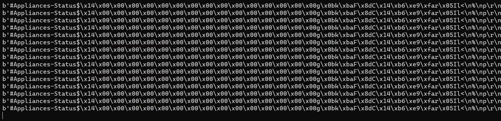
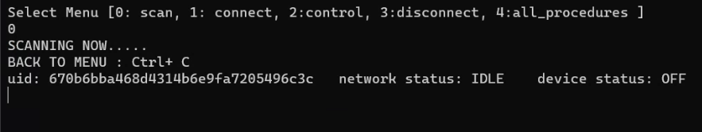
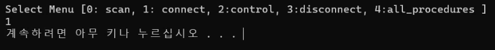
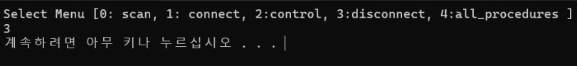

# SUB PJT 3 

알고리즘 고도화 및 스마트홈 서비스 완성

## 환경

1. ROS

   - ROS eloquent - 20200124 release
   - python 3.7.5
   - openssl 1.0.2u
   - choco 0.10.15
   - opencv 3.4.6
   - rti 5.3.1
   - opensplice 6.9.190403

2. tensorflow

   - tnesorflow 1.15
   - CUDA Toolkit 10.0
   - cuDNN 7.6.4

   

## 목표

1. 사용자 인터페이스 구현

2. socket.io를 활용한 서버/클라이언트 알고리즘

3. 딥뉴럴 네트워크를 이용한 object인식

4. UDP 통신을 이용한 Advanced IoT 제어

5. 예제 프로젝트

   - Custom Object를 옮기는 Multiplay Mini-Game Project

   - 스마트홈 경비 서비스

6. 심화 프로젝트


## 필수 지식 학습

### Tensorflow

TF는 뉴럴 네트워크의 구조와 입출력에 대한 Loss만 정의되면, 데이터를 가지고 자동 미분으로 back propagation을 수행할수 있음.

TensorRT를 사용해서 학습한 모델을 inference용으로 실제 적용할수 있음


**TF object Detection API**

Classfication, Localization이 합쳐진 문제 + bounding box

Faster R-CNN

- 속도 문제
- 해결하기 위한 모델
  - Single Shot Multi-box detector(SSD)
  - YOLO 시리즈
  - EfficientDet


Object Detection을 위해서 Feature extractor와 Pretrain 모델을 미리 만들어야함.

초보자나 단순히 응용하는 사람은 모델을 만드는게 어려우므로 TF object detection api 를 사용함


### Node.js

CommonJS

V8엔진

Asynchronous I/O

blocking/nonblocking I/O


### socket.io

### UDP 통신

TCP Transfer Control Protocol: 신뢰성 프로토콜

UDP User Datagram Protocol: 비신뢰성 프로토콜

-  비연결형 서비스: ip와 포트만 맞추면 통신가능
- 헤더의 checksum 필드를 통해 최소한의 오류만 검출
- 연속성이 중요한 서비스에서 사용


### Mapping, Localization

로봇의 위치와 센서들을 기반으로 맵을 그려내는 것

1) Landmark/Feature

   센서 데이터를 그대로 쓰지 않고 주변의 특징점을 가지고 맵을 만드는 방식

   카메라의 이미지를 기반으로한 descriptor 사용

   QR코드나 SURF, SIFT등 사용

   거리 정보까지 정확히 구하기 힘듦

2) Grid Map

   공간을 grid cell로 표현하며 물체가 존재하지 않는 영역과 존재하는 영역을 직접 cell에 표시하는 방식

   각 cell에 2D 라이다의 레이저가 지나간곳은 0 벽이나 물체가 있으면 1로 채움. 지나가지 않은 공간은 0.5로 작성

**Bresenham algorithm**

마킹된 현재 픽셀로부터 다음 픽셀을 어떻게 선택할지 결정하는 알고리즘

**Particle Filter**

정규분포가 아닌 노이즈나 기존 상태나 측정치 등에 대한 확률정보가 없을 때 사용

importance sampling을 통해서 정규분포가 아닌 분포에서 샘플링 가능

로봇의 이동을 예측하는 모델들은 비선형으로 정의된 경우가 많아서 위치추정에 많이 사용됨

Monte Carlo localization을 구현하는데 사용됨

**Prediction Model**

파티클 필터 기반 위치 추정시 사용되는 예측 모델

- odometry base model,  velocity based model

Thrun, FOx, Burgard의 particle motion model 사용

**Weighting**

**Resampling**


## 개발 및 결과

### 1. iot_udp

**초기 상태**



`class iot_udp. __init__`

```python
class iot_udp(Node):

    def __init__(self):
        super().__init__('iot_udp')

        self.ip='127.0.0.1'
        self.port=7502
        self.send_port=7401

        # 로직 1. 통신 소켓 생성
        self.sock = socket.socket(socket.AF_INET, socket.SOCK_DGRAM)
        recv_address = (self.ip,self.port)
        self.sock.bind(recv_address)
        self.data_size=65535 
        self.parsed_data=[]
        
        # 로직 2. 멀티스레드를 이용한 데이터 수신
        thread = threading.Thread(target=self.recv_udp_data)
        thread.daemon = True 
        thread.start() 

        self.is_recv_data=False


        while True:
		# 로직 5. 사용자 메뉴 생성
            os.system('cls')
            print('Select Menu [0: scan, 1: connect, 2:control, 3:disconnect, 4:all_procedures ] ')
            menu = int(input())

            if menu == 0:
                self.scan()
            elif menu == 1:
                self.connect()
            elif menu == 2:
                self.control()
            elif menu == 3:
                self.disconnect()
            elif menu == 4:
                self.all_procedures()
            os.system('pause')
```

로직 1: 통신을 위한 udp 소켓 생성, ip, port는 시뮬레이터와 같은 것을 사용

로직 2: 데이터 수신을 위한 스레드생성. thread의 daemon을 True로 설정해서 메인 스레드가 종료되면 자동 종료

로직 5: 사용자 메뉴 생성 int값을 입력으로 받아서 함수 실행


```python
    def data_parsing(self, raw_data) :
        # print(raw_data) # len(raw_data) = 57 byte
        #b'#Appliances-Status$\x14\x00\x00\x00\x00\x00\x00\x00\x00\x00\x00\x00\x00\x00\x00\x00g\x0bk\xbaF\x8dC\x14\xb6\xe9\xfar\x05Il<\n%\np\r\n'
        
        '''
        로직 3. 수신 데이터 파싱
        '''
        header = raw_data[:19].decode() # 14 byte, #Appliances-Status$
        data_length = raw_data[19:23] # 4 byte, \x14\x00\x00\x00
        aux_data = raw_data[23:35] # 12 byte, \x00\x00\x00\x00\x00\x00\x00\x00\x00\x00\x00\x00
        # data_length[0]: int형식(4 byte)으로 끊어서 확인
        if header == "#Appliances-Status$" and data_length[0] == 20:
            uid_pack = raw_data[35:51] # 16 byte
            uid = self.packet_to_uid(uid_pack) # 16 byte

            # params_status와 맞추기 위해 1byte씩 사용, status = (number, number) 이므로 int로 변환
            network_status = (int(raw_data[51]), int(raw_data[52])) # 2 byte
            device_status = (int(raw_data[53]), int(raw_data[54])) # 2 byte
            
            self.is_recv_data = True
            self.recv_data = [uid, network_status, device_status]


    def packet_to_uid(self,packet):
        # packet: b'g\x0bk\xbaF\x8dC\x14\xb6\xe9\xfar\x05Il<\n%\np'
        uid=""
        for data in packet:
            # data는 1byte(\x__ 이거나 g, k 같은 char) 씩 판별
            if len(hex(data)[2:4])==1: # ascii code가 있는 경우 char로 변환되므로 앞에 0 추가
                uid+="0"
            
            uid+=hex(data)[2:4]
```

로직 3: iot 가전의 일정 범위 안으로 들어가는 경우 데이터 수신

프로토콜에 맞게 byte단위로 파싱하여 디코딩

```python
    def send_data(self, uid, cmd):
        '''
        로직 4. 데이터 송신 함수 생성
        '''
 
        header = '#Ctrl-command$'.encode()
        # 같은 의미. data_length = (18).to_bytes(4, byteorder="little")
        data_length = struct.pack('i', 18)
        aux_data = bytes(12)
        self.upper = header + data_length + aux_data
        self.tail = bytes([0x0D, 0x0A])

        uid_pack = self.uid_to_packet(uid)
        cmd_pack = bytes([cmd[0], cmd[1]])

        send_data = self.upper + uid_pack + cmd_pack + self.tail
        # print(send_data, len(send_data))
        self.sock.sendto(send_data, (self.ip, self.send_port))
```

로직 4: 데이터 송신할때도 프로토콜에 맞게 인코딩

```python
    def scan(self):
        
        print('SCANNING NOW.....')
        print('BACK TO MENU : Ctrl+ C')
        '''
        로직 6. iot scan

        주변에 들어오는 iot 데이터(uid,network status, device status)를 출력하세요.

        문제점: udp 통신이 있어야만 queue가 갱신됨
        
        '''
        try:
            tmp = 0
            prev_data = set()
            while True:
                cur_data = set(self.parsed_data_deque)
                if prev_data == cur_data:
                    continue
                
                for data in cur_data:
                    print("uid: {}\tnetwork status: {}\tdevice status: {}"
                        .format(
                            data[0],
                            params_status[data[1]],
                            params_status[data[2]]
                        )
                    )
                prev_data = cur_data
        except KeyboardInterrupt:
            os.system('cls')
```

로직 6: 수신되는 데이터 출력

- 너무 많은 값이 출력되어서 일정 개수당 하나씩만 출력

Ctrl+C 를 사용하면 keyboardInterrupt Error 발생

- 예외 처리를 해서 반복문을 빠져 나올수 있게 설정

문제점

- 수신되는 데이터가  있어야만 queue가 갱신됨
- 수신되는 데이터가 없으면 마지막 상태 저장


```python
    def connect(self):
        
        '''
        로직 7. iot connect

        iot 네트워크 상태를 확인하고, CONNECTION_LOST 상태이면, RESET 명령을 보내고,
        나머지 상태일 때는 TRY_TO_CONNECT 명령을 보내서 iot에 접속하세요.

        '''
        if self.is_recv_data:
            while params_status[self.recv_data[1]] != 'CONNECTION':
                if params_status[self.recv_data[1]] == "CONNECTION_LOST":
                    self.send_data(self.recv_data[0], params_control_cmd["RESET"])
                else:
                    self.send_data(self.recv_data[0], params_control_cmd["TRY_TO_CONNECT"])

```

로직 7: 네트워크 상태 확인후 연결

- 연결될때까지 데이터 전송

- disconnect도 똑같이 끊길때까지 데이터 전송


```python
    def control(self):
        '''
        로직 8. iot control
        
        iot 디바이스 상태를 확인하고, ON 상태이면 OFF 명령을 보내고, OFF 상태면 ON 명령을 보내서,
        현재 상태를 토글시켜주세요.
        '''

        if self.is_recv_data:
            if params_status[self.recv_data[1]] != 'CONNECTION': 
                return
            cur_status = params_status[self.recv_data[2]]
            if cur_status == "ON":
                while params_status[self.recv_data[2]] != 'OFF':
                    self.send_data(self.recv_data[0], params_control_cmd["SWITCH_OFF"])
            elif cur_status == "OFF":
                while params_status[self.recv_data[2]] != 'ON':
                    self.send_data(self.recv_data[0], params_control_cmd["SWITCH_ON"])
```

로직 8: 연결된 상태에서 on off 토글


**결과**





.png)

.png)

- 잘안보여서 4번에서 on 확인



.png)

.png)

.png)


[전체 코드](./src/iot_udp_dg.py)

